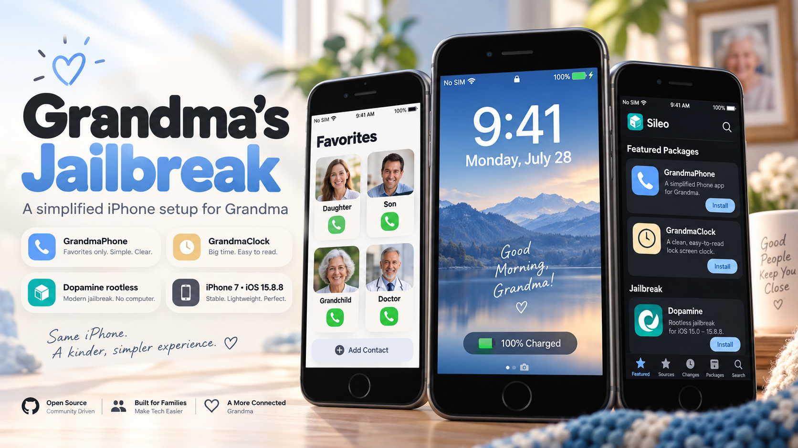
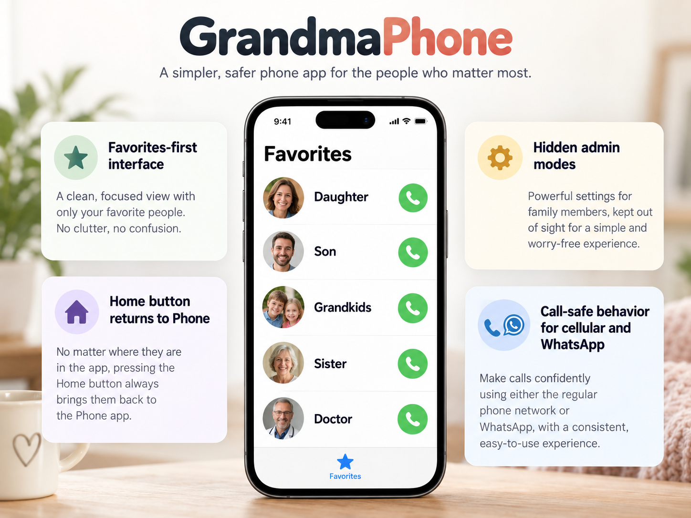
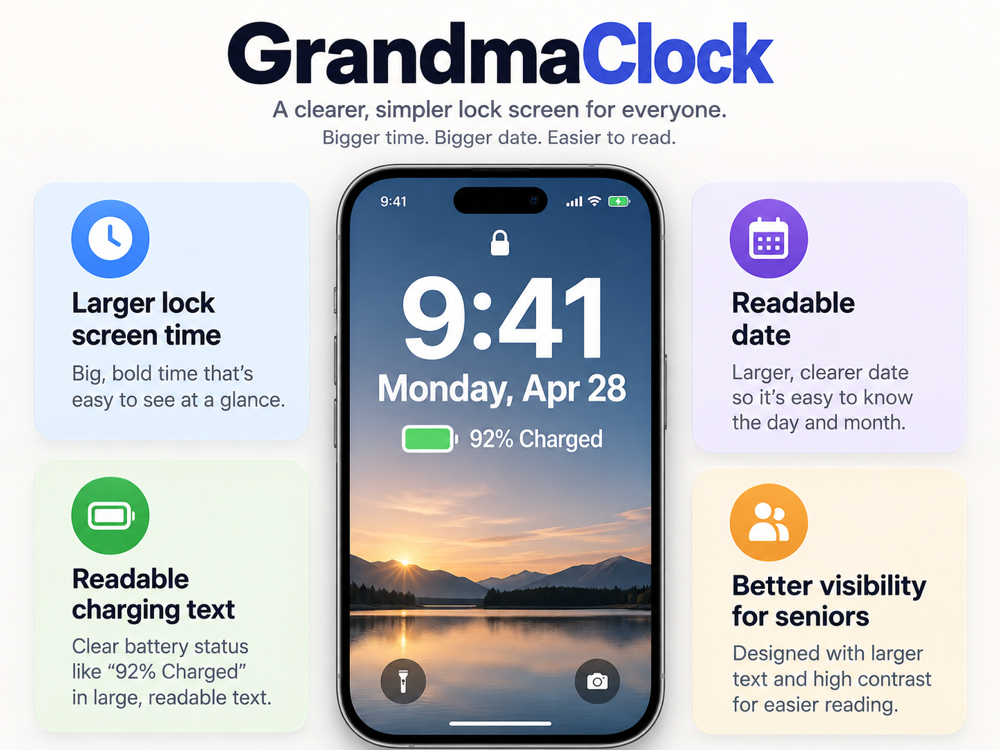
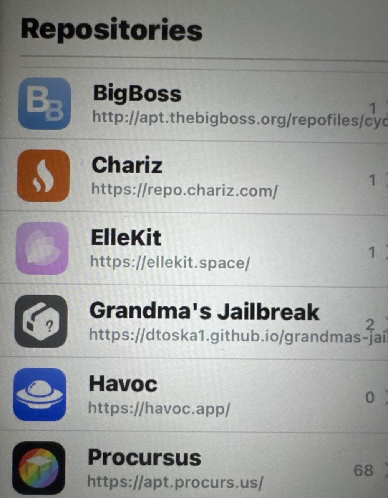
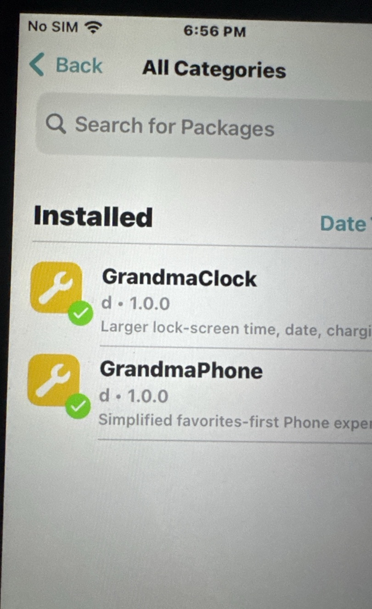
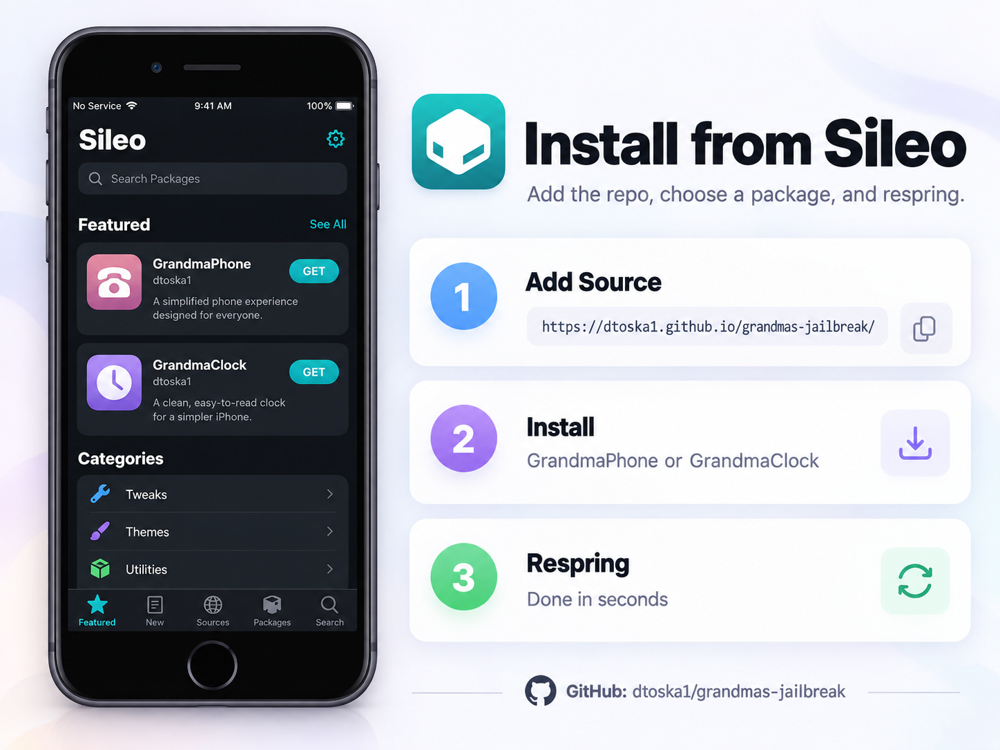

<div align="center">


# Grandma’s Jailbreak

**A simpler iPhone experience, built for family.**

[Website](https://dtoska1.github.io/grandmas-jailbreak/) · [GitHub](https://github.com/dtoska1/grandmas-jailbreak)

`https://dtoska1.github.io/grandmas-jailbreak/`

</div>

<p align="center"></p>

## About

Grandma’s Jailbreak is a small, family-maintained set of jailbreak tweaks designed to make an older iPhone easier to use for an elderly family member while keeping familiar Apple calling behavior where possible.

The public release contains two packages:

- **GrandmaPhone** — a Favorites-first Phone experience with Grandma Mode, temporary Admin Mode, persistent Super Admin Mode, and call-aware behavior.
- **GrandmaClock** — larger, clearer lock-screen and status-bar time with improved date and charging readability.

The current release is intentionally conservative about compatibility: it documents what has been physically tested on the real development phone.

## GrandmaPhone

<p align="center"></p>

GrandmaPhone is built around one simple goal: the everyday user should always be able to get back to familiar people and call them without getting lost elsewhere in the phone.

### Grandma Mode

- Opens and returns to **Phone → Favorites**.
- Hides the distracting Phone tabs and editing controls.
- Blocks the App Switcher and Siri while Grandma Mode is active.
- Blocks Notification Center and Control Center while unlocked.
- Preserves normal wake/unlock behavior.
- Allows normal cellular calls and supported CallKit calls, including WhatsApp voice/video calls.
- Gets out of the way while a call is active.
- Returns to Favorites after the final call ends.
- A reboot/respring safely starts back in Grandma Mode.

### Admin modes

**Normal Admin Mode** temporarily restores normal iPhone behavior for family maintenance and automatically expires after about **15 minutes**.

**Super Admin Mode** restores normal iPhone behavior without the 15-minute timeout and remains active until deliberately exited.

The existence and behavior of both modes are public. Their exact access gestures and internal implementation are intentionally not published in this repository.

## GrandmaClock

<p align="center"></p>

GrandmaClock improves readability without globally enlarging text across unrelated apps.

- Larger lock-screen time.
- Larger lock-screen date.
- Larger charging-status text.
- Larger status-bar clock.
- Dynamic width handling so enlarged times do not truncate.
- No global Dynamic Type changes that would make names in apps such as WhatsApp unreadable.

## Live in Sileo

<table>
<tr>
<td align="center"><br><b>Grandma’s Jailbreak source</b></td>
<td align="center"><br><b>GrandmaPhone + GrandmaClock</b></td>
</tr>
</table>

## Install

Add this source to Sileo:

```text
https://dtoska1.github.io/grandmas-jailbreak/
```

Then install **GrandmaPhone**, **GrandmaClock**, or both, and respring when prompted.

<p align="center"></p>

## Tested configuration

- **Device:** iPhone 7
- **iOS:** 15.8.8
- **Jailbreak:** Dopamine rootless
- **Package manager / injection:** Sileo + ElleKit

The iPhone 6s on iOS 15.x is a future target, but it should remain listed as untested until physically verified.

## Documentation

- [Features](docs/FEATURES.md)
- [Admin Modes](docs/ADMIN_MODES.md)
- [Installation](docs/INSTALLATION.md)
- [Compatibility](docs/COMPATIBILITY.md)
- [Safety & Recovery](docs/SAFETY_AND_RECOVERY.md)
- [Technical Overview](docs/TECHNICAL_OVERVIEW.md)
- [Support](docs/SUPPORT.md)
- [Changelog](docs/CHANGELOG.md)
- [License](LICENSE.md)

## Notes

- This is a jailbreak tweak project, not an App Store application.
- FaceTime is not a release focus; inconsistent FaceTime behavior observed during development also occurred with tweaks inactive.
- Carrier-lock/SIM work on the development device is a separate project and is not part of these packages.
- Admin Mode is a convenience/maintenance feature, not a security boundary.

## Author

**d** · [@dtoska1](https://github.com/dtoska1)
